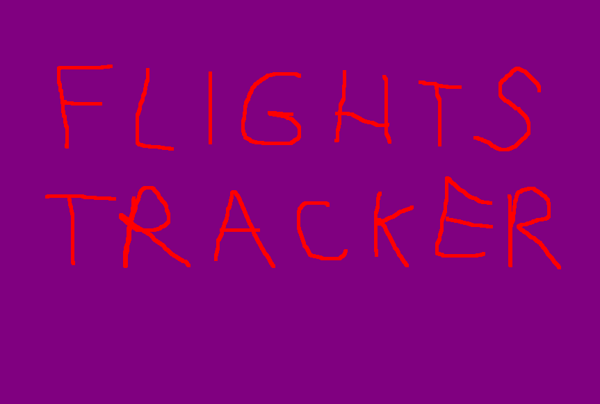

<!--
PROJECT TEMPLATE BY Othneil Drew (othneildrew)
check his repository: https://github.com/othneildrew/Best-README-Template
I HAVE KEPT HIS COMMENTS

*** Thanks for checking out the Best-README-Template. If you have a suggestion
*** that would make this better, please fork the repo and create a pull request
*** or simply open an issue with the tag "enhancement".
*** Thanks again! Now go create something AMAZING! :D
-->

<!-- PROJECT SHIELDS -->
<!--
*** I'm using markdown "reference style" links for readability.
*** Reference links are enclosed in brackets [ ] instead of parentheses ( ).
*** See the bottom of this document for the declaration of the reference variables
*** for contributors-url, forks-url, etc. This is an optional, concise syntax you may use.
*** https://www.markdownguide.org/basic-syntax/#reference-style-links
-->
[![Contributors][contributors-shield]][contributors-url]
[![Forks][forks-shield]][forks-url]
[![Stargazers][stars-shield]][stars-url]
[![Issues][issues-shield]][issues-url]
[![MIT License][license-shield]][license-url]
[![LinkedIn][linkedin-shield]][linkedin-url]

<!-- PROJECT LOGO -->
 

  

  <h3 align="center">FlightsTracker</h3>

  

    Our project for Advanced OOP Classes
     
    <a href="https://github.com/janskwr/FlightsTracker"><strong>Explore the docs »</strong></a>
     
     
    <a href="https://github.com/janskwr/FlightsTracker">View Demo</a>
    ·
    <a href="https://github.com/janskwr/FlightsTracker/issues">Report Bug</a>
    ·
    <a href="https://github.com/janskwr/FlightsTracker/issues">Request Feature</a>
  

<!-- TABLE OF CONTENTS -->

  
Table of Contents

  <ol>
    <li>
      <a href="#about-the-project">About The Project</a>
    </li>
    <li>
      <a href="#requirements">Requirements</a>
    </li>
    <li><a href="#installation">Installation</a></li>
    <li><a href="#contributing">Contributing</a></li>
    <li><a href="#license">License</a></li>
    <li><a href="#authors">Authors</a></li>
    <li><a href="#contact">Contact</a></li>
  </ol>

<!-- ABOUT THE PROJECT -->
## About The Project

It's our project for Advanced OOP Classes. It's basically a full stack application with Retrofit2 serving a REST API. It's a real time flights tracker with airports data.

<!-- REQUIREMENTS -->
## Requirements

* [Java SE 17](https://www.oracle.com/java/technologies/javase/jdk17-archive-downloads.html)
* [Maven](https://maven.apache.org/)
* [Retrofit2](https://square.github.io/retrofit/)
* [JavaFX](https://openjfx.io/)
* [OpenSky REST-API access](https://openskynetwork.github.io/opensky-api/rest.html#flights-in-time-interval)
* [airports data from kaggle (already provided in repository)](https://www.kaggle.com/mike90/airport-codes)
* [any integrated development environment for Java (we recommend using IntelliJ by JetBrains)](https://www.jetbrains.com/idea/)

<!-- INSTALLATION -->
## Installation

1. Download/clone all files from this repository.
2. Now you can open and use our Java program with full functionality!

<!-- CONTRIBUTING -->
## Contributing

Contributions are what make the open source community such an amazing place to be learn, inspire, and create. Any contributions you make are **greatly appreciated**.

1. Fork the Project
2. Create your Feature Branch (`git checkout -b feature/AmazingFeature`)
3. Commit your Changes (`git commit -m 'Add some AmazingFeature'`)
4. Push to the Branch (`git push origin feature/AmazingFeature`)
5. Open a Pull Request

<!-- LICENSE -->
## License

Distributed under the MIT License. See `LICENSE` for more information.

<!-- LICENSE -->
## Authors

* [Jan Skwarek](https://github.com/janskwr)
* [Krzysztof Wodnicki](https://github.com/wodnickik)

<!-- CONTACT -->
## Contact

* Jan Skwarek - janskwarek@protonmail.ch - [Instagram](https://www.instagram.com/janskwr/) - [Facebook](https://www.facebook.com/jan.skwarek) - [LinkedIn](https://www.linkedin.com/in/jan-skwarek-87b01419b/)
* Krzysztof Wodnicki - @ - [Facebook](https://www.facebook.com/profile.php?id=100008702560751) - [LinkedIn](https://www.linkedin.com/in/krzysztof-w-5291b921b/)

Project Link: [https://github.com/janskwr/FlightsTracker](https://github.com/janskwr/FlightsTracker)

<!-- MARKDOWN LINKS & IMAGES -->
<!-- https://www.markdownguide.org/basic-syntax/#reference-style-links -->
[contributors-shield]: https://img.shields.io/github/contributors/janskwr/FlightsTracker.svg?style=for-the-badge
[contributors-url]: https://github.com/janskwr/FlightsTracker/graphs/contributors
[forks-shield]: https://img.shields.io/github/forks/janskwr/FlightsTracker.svg?style=for-the-badge
[forks-url]: https://github.com/janskwr/FlightsTracker/network/members
[stars-shield]: https://img.shields.io/github/stars/janskwr/FlightsTracker.svg?style=for-the-badge
[stars-url]: https://github.com/janskwr/FlightsTracker/stargazers
[issues-shield]: https://img.shields.io/github/issues/janskwr/FlightsTracker.svg?style=for-the-badge
[issues-url]: https://github.com/janskwr/FlightsTracker/issues
[license-shield]: https://img.shields.io/github/license/janskwr/FlightsTracker.svg?style=for-the-badge
[license-url]: https://github.com/janskwr/FlightsTracker/blob/master/LICENSE.txt
[linkedin-shield]: https://img.shields.io/badge/-LinkedIn-black.svg?style=for-the-badge&logo=linkedin&colorB=555
[linkedin-url]: https://www.linkedin.com/in/jan-skwarek-87b01419b/
[product-screenshot]: images/screenshot.png
